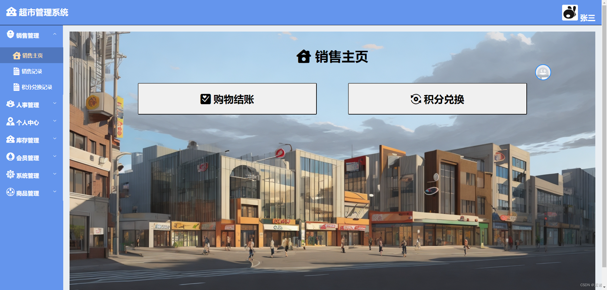

计算机专业课程设计、毕业设计。超市管理系统，后端java，springboot，SSM框架。前端Vue+ElementUI。包括销售管理、人事管理、个人中心、库存管理、会员管理、系统管理、商品管理七个功能模块
# 1 销售管理
## 1.1 销售主页
销售主页包括购物结账、积分兑换。

### 1.1.1 购物结账

### 1.1.2 积分兑换

## 1.2 销售记录
查看商品销售记录和明细

## 1.3 积分兑换记录

# 2 人事管理
## 2.1 部门管理

## 2.2 员工管理

# 3 个人中心
## 3.1 修改密码

## 3.2 个人资料

# 4 库存管理
## 4.1 查看出库明细

## 4.2 查看入库明细

# 5 会员管理

# 6 系统管理
## 6.1 角色管理

## 6.2 菜单管理

# 7 商品管理
## 7.1 分类管理

## 7.2 商品信息

## 7.3 积分商品

## 7.4 销售统计

# 8 项目文档

# 源码、数据库获取：

